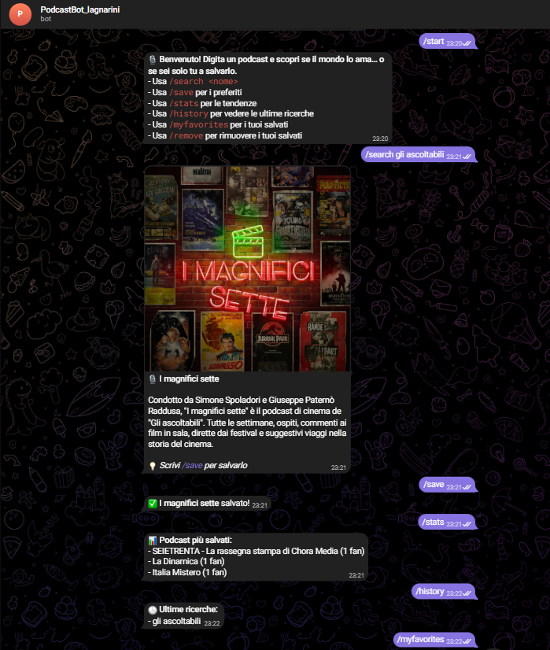
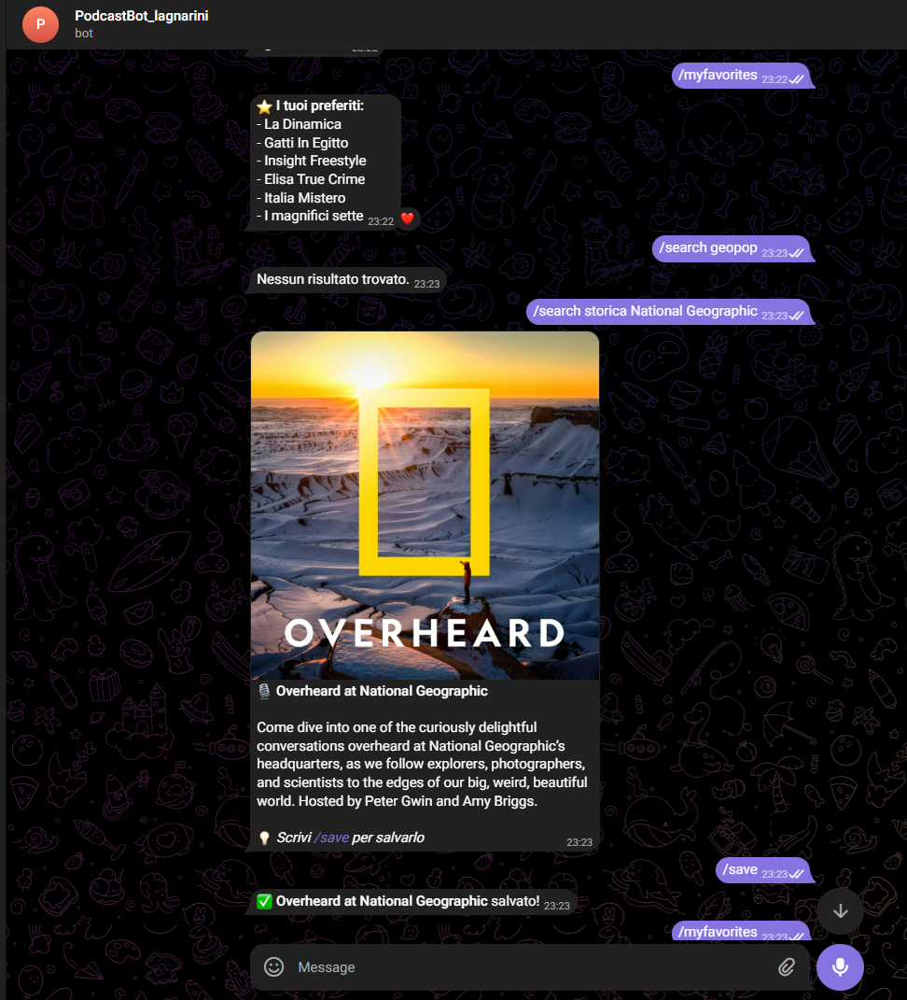
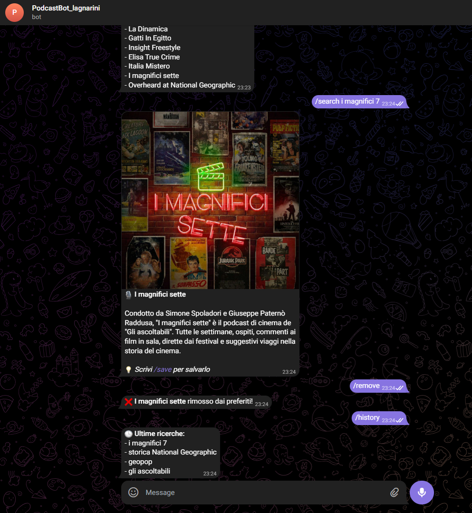

# 🎙️ PodcastBot Lagnarini

Bot Telegram sviluppato in **Java** che permette di cercare podcast tramite **API Taddy**, visualizzarne le informazioni principali e salvarli tra i preferiti.  
Il bot mantiene uno **storico degli utenti**, dei **podcast salvati** e delle **ricerche effettuate**, offrendo anche **statistiche globali**.

---

## 📌 Descrizione del progetto

**PodcastBot Lagnarini** è un bot Telegram che consente agli utenti di:

- 🔍 Cercare podcast per nome o parola chiave
- 📝 Visualizzare descrizione e immagine del podcast
- ⭐ Salvare e rimuovere podcast dai preferiti
- 📂 Visualizzare i propri podcast preferiti
- 📊 Consultare statistiche globali sui podcast più salvati
- 🕘 Visualizzare lo storico delle ultime ricerche effettuate

Il progetto utilizza:

- **Telegram Bot API** per l’interazione con Telegram
- **Taddy API (GraphQL)** per il recupero dei dati sui podcast
- **SQLite** per la persistenza dei dati
- **Maven** per la gestione delle dipendenze

---

## 🌐 API utilizzata

### Taddy API

API **GraphQL** utilizzata per la ricerca dei podcast.

- **Endpoint:**  
  `https://api.taddy.org`

- **Autenticazione tramite header:**
    - `X-API-KEY`
    - `X-USER-ID`

📄 **Documentazione ufficiale:**  
👉 https://taddy.org/developers

---

## ⚙️ Setup del progetto

### 1️⃣ Prerequisiti

- Java 21
- Maven
- Account Telegram
- Bot Telegram creato tramite **@BotFather**
- Account Taddy con **API Key**

---

### 2️⃣ Installazione dipendenze

Nel progetto è già presente il file `pom.xml`.  
Per installare le dipendenze:

```bash
mvn clean install
```

Dipendenze principali:

- Telegram Bots API
- Gson
- SQLite JDBC
- Apache Commons Configuration

---

### 3️⃣ Configurazione API Key

Crea un file `config.properties` nella root del progetto:

```properties
BOT_TOKEN=INSERISCI_IL_TOKEN_DEL_BOT
TADDY_API_KEY=INSERISCI_LA_TUA_API_KEY
TADDY_USER_ID=INSERISCI_IL_TUO_USER_ID
```

⚠️ **Attenzione:** senza questo file il bot **non si avvierà**.

---

### 4️⃣ Setup Database

- Database: **SQLite**
- Creato automaticamente al primo avvio
- File: `podcasts.db`
- Nessuna configurazione manuale richiesta

---

### 5️⃣ Avvio del bot

Avvia il progetto eseguendo la classe **Main**.

---

## 🤖 Guida all’utilizzo

### 📜 Comandi disponibili

| Comando | Descrizione |
|--------|------------|
| /start | Registra l’utente e mostra i comandi |
| /search <nome> | Cerca un podcast |
| /save | Salva l’ultimo podcast cercato |
| /remove | Rimuove l’ultimo podcast cercato dai preferiti |
| /myfavorites | Mostra i podcast salvati |
| /stats | Mostra i podcast più salvati |
| /history | Mostra le ultime ricerche effettuate |

---
## 📸 Dimostrazione del funzionamento

Di seguito alcuni screenshot che mostrano il funzionamento del programma.








## 🗄️ Schema del Database

### Tabella users

| Campo | Tipo |
|------|------|
| chat_id | INTEGER (PK) |
| username | TEXT |

### Tabella favorites

| Campo | Tipo |
|------|------|
| id | INTEGER (PK, AUTOINCREMENT) |
| chat_id | INTEGER (FK → users.chat_id) |
| uuid | TEXT |
| name | TEXT |

### Tabella search_history

| Campo | Tipo |
|------|------|
| id | INTEGER (PK, AUTOINCREMENT) |
| chat_id | INTEGER (FK → users.chat_id) |
| query | TEXT |
| searched_at | DATETIME |

---

### Relazioni

- users 1 → N favorites
- users 1 → N search_history

Ogni utente può salvare più podcast ed effettuare più ricerche.

---

## 📈 Statistiche e Query implementate

### Podcast più salvati (Top 3)

```sql
SELECT name, COUNT(*)
FROM favorites
GROUP BY name
ORDER BY COUNT(*) DESC
LIMIT 3;
```

### Preferiti di un utente

```sql
SELECT name
FROM favorites
WHERE chat_id = ?;
```

### Ultime ricerche di un utente

```sql
SELECT query
FROM search_history
WHERE chat_id = ?
ORDER BY searched_at DESC
LIMIT 5;
```

---

## 🧠 Funzionalità chiave

- Gestione utenti automatica
- Storico ricerche utenti
- Parsing JSON con Gson
- API GraphQL
- Persistenza dati con SQLite
- Gestione errori API e Telegram
- Singleton per configurazione

---

## 👨‍💻 Autore

Progetto realizzato per scopi didattici  
Classe: ITIS Rossi – Lagnarini Iris
